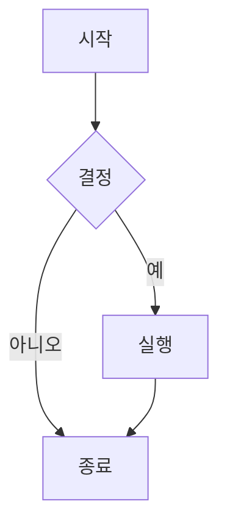
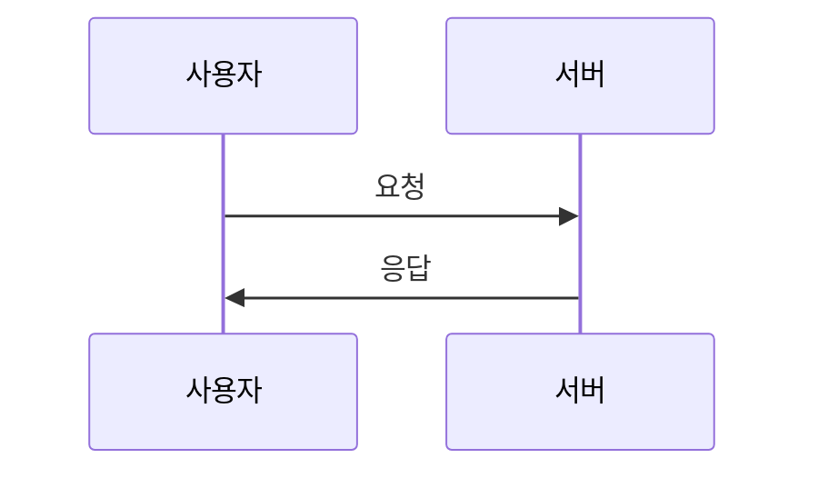
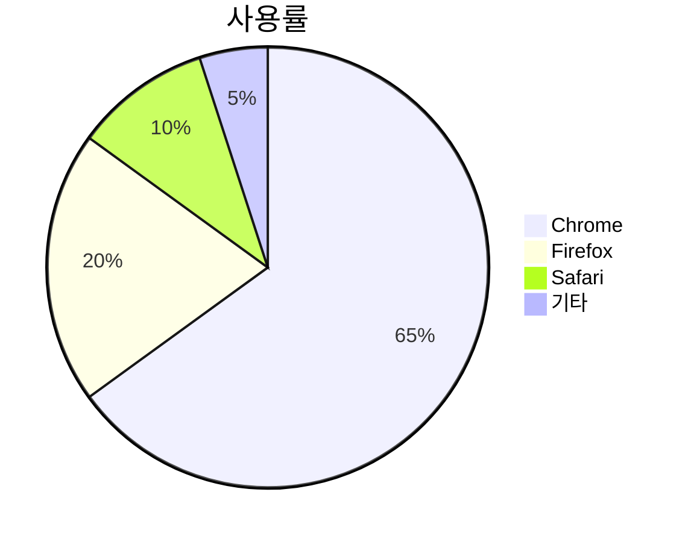
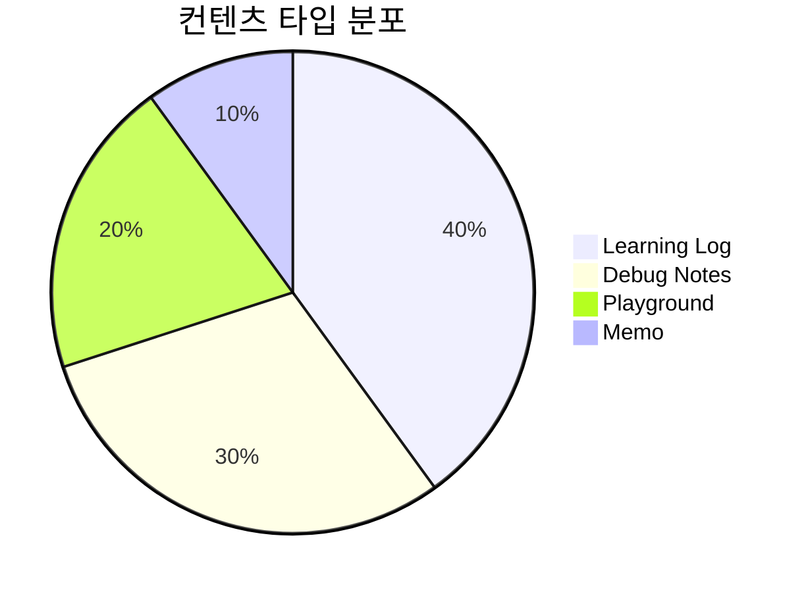

Hextra 테마에서 제공하는 모든 컴포넌트와 기능의 사용법을 정리한 문서입니다.

## 빠른 참조

| 컴포넌트 | 용도 | 타입 |
|---------|------|------|
| [`callout`](#callout-알림-박스) | 알림/강조 박스 | 컨텐츠 |
| [`cards` / `card`](#cards-카드-레이아웃) | 카드 그리드 레이아웃 | 컨텐츠 |
| [`steps`](#steps-단계별-가이드) | 단계별 가이드 | 컨텐츠 |
| [`tabs` / `tab`](#tabs-탭-인터페이스) | 탭 인터페이스 | 컨텐츠 |
| [`details`](#details-접기펼치기) | 접기/펼치기 | 컨텐츠 |
| [`filetree`](#filetree-파일-구조) | 파일 구조 표시 | 컨텐츠 |
| [`icon`](#icon-아이콘) | 인라인 아이콘 | 유틸리티 |
| [`badge`](#badge-배지) | 배지/태그 | 유틸리티 |
| [`asciinema`](#asciinema-터미널-녹화) | 터미널 녹화 재생 | 미디어 |
| [`jupyter`](#jupyter-노트북-임베드) | Jupyter 노트북 임베드 | 미디어 |
| [`pdf`](#pdf-pdf-임베드) | PDF 파일 임베드 | 미디어 |
| [`youtube`](#youtube-유튜브-비디오) | 유튜브 비디오 임베드 | 미디어 |
| [`GitHub Alerts`](#github-alerts-v090) | 깃허브 스타일 알림 | 마크다운 |
| [`Mermaid`](#mermaid-다이어그램) | 다이어그램 | 마크다운 |
| [`Math/LaTeX`](#mathlatex-수식) | 수식 렌더링 | 마크다운 |

---

## 컨텐츠 컴포넌트

### Callout (알림 박스)

강조하거나 주의를 끌어야 하는 내용을 표시합니다.

**기본 사용법:**

```markdown

  여기에 내용을 작성합니다.

```

**실제 예시:**


  여기에 내용을 작성합니다.


**사용 가능한 타입:**
- `info` - 정보 (파란색)
- `warning` - 경고 (노란색)
- `error` - 오류 (빨간색)
- `important` - 중요 (보라색)

**고급 옵션:**

```markdown

  커스텀 아이콘과 제목을 사용할 수 있습니다.



  이모지를 아이콘으로 사용할 수도 있습니다.

```

**실제 예시:**


  커스텀 아이콘과 제목을 사용할 수 있습니다.



  이모지를 아이콘으로 사용할 수도 있습니다.


**매개변수:**
- `type` - 알림 타입 (info, warning, error, important)
- `title` - 커스텀 제목
- `icon` - 커스텀 아이콘 이름
- `emoji` - 이모지 사용
- `collapsed` - 기본 접힘 상태 (true/false)

---

### Cards (카드 레이아웃)

카드 형태로 콘텐츠를 그리드 레이아웃으로 표시합니다.

**기본 사용법:**

```markdown

  
  
  

```

**실제 예시:**


  
  
  


**그리드 컬럼 지정:**

```markdown

  
  

```

**카드 옵션:**

```markdown

```

**카드 매개변수:**
- `link` - 링크 URL
- `title` - 제목
- `subtitle` - 부제목
- `icon` - 아이콘 이름
- `tag` - 태그 텍스트
- `tagColor` - 태그 색상 (info, warning, danger, success)
- `image` - 이미지 경로
- `imageStyle` - 이미지 스타일 (cover, contain 등)
- `method` - 이미지 처리 방법 (resize, fit, fill, crop)
- `options` - 이미지 옵션 (크기, 품질 등)

---

### Steps (단계별 가이드)

순차적인 단계를 표시합니다.

**사용법:**

```markdown
{}

### 첫 번째 단계

첫 번째 단계에 대한 설명입니다.

### 두 번째 단계

두 번째 단계에 대한 설명입니다.

코드 블록도 포함할 수 있습니다:

\```bash
npm install hextra
\```

### 세 번째 단계

마지막 단계입니다.

{}
```

**실제 예시:**

{}

### 프로젝트 생성

새로운 Hugo 프로젝트를 생성합니다.

```bash
hugo new site my-site
```

### 테마 설치

Hextra 테마를 설치합니다.

### 로컬 서버 실행

개발 서버를 시작합니다.

```bash
hugo server -p 1313
```

{}

**주의사항:**
- `{}` (퍼센트 기호) 사용 필수
- 각 단계는 `###` (h3) 헤딩으로 구분
- 마크다운 컨텐츠 포함 가능

---

### Tabs (탭 인터페이스)

여러 콘텐츠를 탭으로 전환하며 표시합니다.

**기본 사용법:**

```markdown


  
  \```json
  {
    "name": "hextra"
  }
  \```
  

  
  \```yaml
  name: hextra
  \```
  

  
  \```toml
  name = "hextra"
  \```
  


```

**실제 예시:**



  
  ```json
  {
    "title": "jacti-log",
    "theme": "hextra"
  }
  ```
  

  
  ```yaml
  title: jacti-log
  theme: hextra
  ```
  

  
  ```toml
  title = "jacti-log"
  theme = "hextra"
  ```
  



**탭 동기화:**

동일한 `items`를 가진 탭들이 자동으로 동기화됩니다.
(`hugo.yaml`에서 `params.page.tabs.sync: true` 설정 필요)

**기본 선택 탭:**

```markdown

  ...
  ...  <!-- YAML이 기본 선택됨 (0부터 시작) -->
  ...

```

---

### Details (접기/펼치기)

접을 수 있는 섹션을 만듭니다.

**기본 사용법:**

```markdown

  여기에 숨겨진 콘텐츠를 작성합니다.

  - 리스트
  - 코드 블록
  - 다른 마크다운 요소

```

**실제 예시:**


  여기에 숨겨진 콘텐츠를 작성합니다.

  - 리스트 항목 1
  - 리스트 항목 2
  - 코드나 다른 마크다운 요소도 포함 가능


**기본 열림 상태:**

```markdown

  기본적으로 펼쳐진 상태로 표시됩니다.

```

---

### Filetree (파일 구조)

파일/폴더 구조를 시각적으로 표시합니다.

**사용법:**

```markdown

  
    
      
      
    
    
      
    
  
  

```

**실제 예시:**


  
    
      
      
    
    
      
      
    
  
  


**매개변수:**
- `name` - 파일/폴더 이름
- `state` - 폴더 상태 (open/closed)

---

## 유틸리티 컴포넌트

### Icon (아이콘)

인라인으로 아이콘을 삽입합니다.

**사용법:**

```markdown
 GitHub에서 보기
 문서 읽기
 새로운 기능
```

**실제 예시:**

 GitHub에서 보기
 문서 읽기
 새로운 기능
 3D 오브젝트
 코드 작성

**사용 가능한 아이콘:**
- 260+ Heroicons v1 outline 아이콘
- 전체 목록: [Heroicons](https://v1.heroicons.com/)
- 주요 아이콘: `github`, `gitlab`, `codeberg`, `bitbucket`, `hugo`, `jupyter`, `sparkles`, `warning`, `shield-exclamation`, `book-open`, `academic-cap`, `cube`, `chart-bar`, `code`, `document-text`, `chat` 등

**커스텀 아이콘 추가:**

`data/icons.yaml`에 SVG 경로 추가:

```yaml
my-icon: '<svg>...</svg>'
```

**설정 필요:**

`hugo.yaml`에 다음 추가:

```yaml
enableInlineShortcodes: true
```

---

### Badge (배지)

텍스트 배지를 표시합니다.

**기본 사용법:**

```markdown



```

**실제 예시:**






**링크가 있는 배지:**

```markdown

```

**매개변수:**
- `content` - 배지 텍스트
- `type` - 색상 타입 (info, warning, error, success)
- `link` - 클릭 시 이동할 링크
- `icon` - 아이콘 이름

---

### Include (포함)

다른 페이지의 콘텐츠를 포함합니다.

**사용법:**

```markdown

```

상대 경로나 절대 경로 모두 사용 가능합니다.

---

## 미디어 컴포넌트

### Asciinema (터미널 녹화)

터미널 세션 녹화를 재생합니다.

**사용법:**

```markdown

```



**매개변수:**
- `file` - .cast 파일 경로 (필수)
- `theme` - 플레이어 테마 (기본값: "asciinema", 옵션: "dracula" 등)
- `speed` - 재생 속도 배율 (기본값: 1)
- `autoplay` - 자동 재생 여부 (기본값: false)
- `loop` - 반복 재생 여부 (기본값: false)
- `poster` - 재생 전 표시할 프레임 (예: "npt:1:23")
- `markers` - 시간 마커 (예: "1.5:Installation,3.2:Configuration")

---

### Jupyter (노트북 임베드)

Jupyter 노트북을 페이지에 임베드합니다.

**사용법:**

```markdown
{}
```



  {}
    


---

**참고:**
- **반드시** `{}` (퍼센트 기호) 사용해야 함 (``로는 작동 안 함)
- 파일 경로는 따옴표로 감싸기
- 지원: 로컬 파일 (assets/, page bundle) 및 원격 URL
- 실험적 기능: 일부 셀 타입은 미지원
- LaTeX 수식 포함 시 프론트매터에 `math: true` 추가 필요

---

### PDF (PDF 임베드)

PDF 파일을 페이지에 임베드합니다.

**사용법:**

```markdown

```



**참고:**
- 로컬 파일: ``
- 원격 URL: ``
- iframe으로 렌더링되며 최소 높이 32rem 적용

---

### YouTube (유튜브 비디오)

유튜브 비디오를 임베드합니다 (Hugo 기본 제공).

**사용법:**

```markdown

```



**참고:**
- 비디오 ID만 사용 (전체 URL 아님)
- 예: `https://www.youtube.com/watch?v=w7Ft2ymGmfc` → `"w7Ft2ymGmfc"`
- 추가 옵션: `loading="lazy"`, `autoplay="1"`, `class="my-class"`
- 반응형 임베드로 자동 렌더링

---

## 마크다운 기본 기능

### GitHub Alerts (v0.9.0+)

GitHub 스타일의 알림을 블록쿼트로 작성합니다.

**사용법:**

```markdown
> [!NOTE]
> 참고 사항입니다.

> [!TIP]
> 유용한 팁입니다.

> [!IMPORTANT]
> 중요한 정보입니다.

> [!WARNING]
> 경고 사항입니다.

> [!CAUTION]
> 주의가 필요합니다.
```

**실제 예시:**

> [!NOTE]
> 참고 사항입니다. 이 문서는 Hextra v0.9.0 이상에서 사용 가능합니다.

> [!TIP]
> 유용한 팁입니다. 빠른 참조 테이블을 클릭하면 해당 섹션으로 이동합니다.

> [!IMPORTANT]
> 중요한 정보입니다. 모든 예시는 실제로 렌더링되어 표시됩니다.

> [!WARNING]
> 경고 사항입니다. Shortcode를 문서화할 때는 이스케이프 처리가 필요합니다.

> [!CAUTION]
> 주의가 필요합니다. 잘못된 문법은 빌드 에러를 발생시킬 수 있습니다.

---

### Mermaid (다이어그램)

코드 블록으로 다이어그램을 작성합니다.

**플로우차트:**

````markdown

````

**실제 예시:**


**시퀀스 다이어그램:**

````markdown

````

**파이 차트:**

````markdown

````

**실제 예시:**



---

### Math/LaTeX (수식)

KaTeX를 사용한 수식 렌더링입니다.

**인라인 수식:**

```markdown
질량-에너지 등가 공식: $E=mc^2$
```

**실제 예시 (인라인):**

질량-에너지 등가 공식: $E=mc^2$

피타고라스 정리: $a^2 + b^2 = c^2$

**블록 수식:**

```markdown
$$
\int_{-\infty}^{\infty} e^{-x^2} dx = \sqrt{\pi}
$$
```

**실제 예시 (블록):**

$$
\int_{-\infty}^{\infty} e^{-x^2} dx = \sqrt{\pi}
$$

$$
f(x) = \frac{1}{\sigma\sqrt{2\pi}} e^{-\frac{(x-\mu)^2}{2\sigma^2}}
$$

**설정 필요:**

`hugo.yaml`에 다음 추가:

```yaml
markup:
  goldmark:
    extensions:
      passthrough:
        enable: true
        delimiters:
          block:
          - - \[
            - \]
          - - $$
            - $$
          inline:
          - - \(
            - \)
          - - $
            - $
    renderer:
      unsafe: true
```

---

## 히어로/랜딩 컴포넌트

랜딩 페이지를 위한 특수 컴포넌트입니다.

### Hero Components

```markdown

  메인 헤드라인



  서브타이틀 설명





  <span>새 소식</span>
  

```

**실제 예시:**


  Hextra 컴포넌트 마스터하기



  모든 컴포넌트를 코드와 실제 예시로 배우는 완벽 가이드





  <span>Hextra on GitHub</span>
  


### Feature Components

```markdown

  
  

```

**실제 예시:**


  
  
  
  


---

## 사용 팁 및 모범 사례

### Shortcode 타입 선택

- `` - HTML 컨텐츠용 (마크다운 처리 안됨)
- `{}` - 마크다운 컨텐츠용 (마크다운 처리됨)

**예시:**

```markdown
<!-- HTML만 포함 -->

  <strong>굵은</strong> 텍스트


<!-- 마크다운 포함 -->
{}
  **굵은** 텍스트
{}
```

**실제 예시:**

**HTML 모드 (꺾쇠 괄호)** - 마크다운이 처리되지 않고 그대로 표시:


  <strong>HTML로 굵게</strong> 처리하고 **마크다운은 그대로** 표시됩니다.


**마크다운 모드 (퍼센트 기호)** - 마크다운이 렌더링됨:

{}
  <strong>HTML로 굵게</strong> 처리하고 **마크다운도 굵게** 렌더링됩니다.
{}

~위 두 예시를 비교하면 `**마크다운**` 부분의 렌더링 차이를 확인할 수 있습니다.~ \
현재는 차이가 없습니다.

### 다크 모드 지원

모든 Hextra 컴포넌트는 자동으로 다크 모드를 지원합니다.

### 성능 최적화

- 이미지 카드: `method="resize"`와 `options`로 이미지 최적화
- 비디오: YouTube shortcode가 lazy loading 지원
- 대용량 PDF: 외부 링크 고려

### 접근성

- Callout에 적절한 `type` 사용 (의미 전달)
- 카드에 명확한 `title` 제공
- 아이콘에 텍스트 레이블 함께 제공

---

## 참고 자료

- [Hextra 공식 문서](https://imfing.github.io/hextra/)
- [Heroicons v1](https://v1.heroicons.com/) - 아이콘 목록
- [Mermaid 문서](https://mermaid.js.org/) - 다이어그램 문법
- [KaTeX 지원 함수](https://katex.org/docs/supported.html) - 수식 문법

---

**마지막 업데이트:** 2025-11-10
