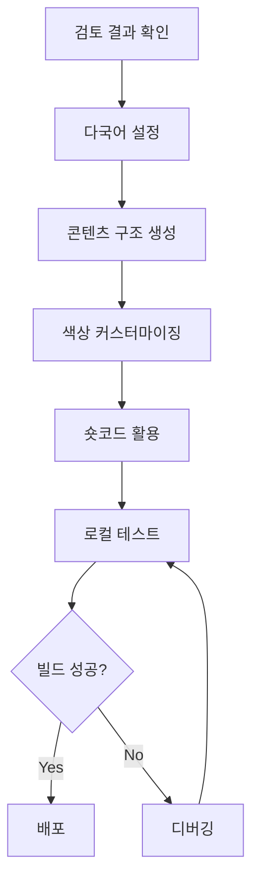

# Codex를 위한 Hugo Hextra 개발 스니펫 모음

**생성일**: 2025-11-06
**목적**: Codex가 웹 검색 없이 최신 Hextra 코드를 활용할 수 있도록 지원

---

## 📁 파일 구조

```
dev-docs/
├── commands/
│   ├── README.md                          # 이 파일 (안내서)
│   ├── LATEST_REVIEW_COMMAND.md           # 최신 검토 결과 및 명령
│   ├── 01-multilingual-setup.md           # 다국어 설정
│   ├── 02-content-structure.md            # 콘텐츠 구조
│   ├── 03-color-customization.md          # 색상 커스터마이징
│   ├── 04-shortcodes-reference.md         # 숏코드 레퍼런스
│   └── legacy/                            # 이전 명령 보관
└── 1차_개발계획.md                         # 원본 개발 계획 (검토됨)
```

---

## 🎯 각 파일 용도

### LATEST_REVIEW_COMMAND.md
- **용도**: 1차 개발 계획 검토 결과
- **내용**:
  - 테마 모듈 복원 오류 지적
  - 수정된 작업 우선순위
  - Codex가 실행해야 할 명령어
  - 주의사항 및 금지 사항

### 01-multilingual-setup.md
- **용도**: 다국어 설정 코드 스니펫
- **내용**:
  - `hugo.yaml` 다국어 설정
  - `i18n/ko.yaml`, `i18n/en.yaml` 번역 파일
  - 메뉴 identifier 방식
  - 언어 전환 버튼 추가
  - 완전한 설정 예시

### 02-content-structure.md
- **용도**: 콘텐츠 디렉토리 구조 템플릿
- **내용**:
  - Learning Log 섹션 (`type: docs`)
  - Debug Notes 섹션 (`type: docs`)
  - Playground 섹션 (카드 그리드)
  - About 페이지
  - Workbench (초안)
  - Front Matter 파라미터 설명

### 03-color-customization.md
- **용도**: Tailwind CSS v4 기반 색상 커스터마이징
- **내용**:
  - `assets/css/custom.css` 템플릿
  - HSL 색상 체계 사용법
  - 다크/라이트 모드 변수
  - 컴포넌트별 스타일링
  - 폰트 커스터마이징
  - 색상 팔레트 예시

### 04-shortcodes-reference.md
- **용도**: Hextra 내장 숏코드 사용법
- **내용**:
  - Cards (카드 그리드)
  - Callout (강조 박스)
  - Tabs (탭)
  - Steps (단계별 가이드)
  - Details (접기/펼치기)
  - FileTree (파일 트리)
  - Icon (아이콘)
  - Feature Cards (홈페이지)
  - 실전 예시 모음

---

## 🚀 Codex 사용 가이드

### 1단계: 검토 결과 확인
```bash
# 먼저 이 파일을 읽어보세요
cat dev-docs/commands/LATEST_REVIEW_COMMAND.md
```

**핵심 포인트**:
- ❌ `hugo.yaml`의 `module.imports` 활성화 **금지**
- ❌ `hugo mod tidy` 실행 **금지**
- ✅ 현재 Git Submodule 방식 유지
- ✅ `theme: hextra` 설정 유지

### 2단계: 다국어 설정
```bash
# 스니펫 참조
cat dev-docs/commands/01-multilingual-setup.md
```

**실행 작업**:
1. `hugo.yaml` 업데이트
2. `i18n/ko.yaml` 생성
3. `i18n/en.yaml` 생성 (선택)
4. 메뉴 identifier 방식 적용

### 3단계: 콘텐츠 구조 생성
```bash
# 스니펫 참조
cat dev-docs/commands/02-content-structure.md
```

**실행 작업**:
1. 디렉토리 생성: `learning-log/`, `debug-notes/`, `playground/`, `about/`, `workbench/`
2. 각 섹션에 `_index.md` 작성
3. `type: docs` 설정 (Learning Log, Debug Notes)
4. Front Matter 파라미터 적용

### 4단계: 색상 커스터마이징
```bash
# 스니펫 참조
cat dev-docs/commands/03-color-customization.md
```

**실행 작업**:
1. `assets/css/custom.css` 생성
2. Tailwind CSS v4 변수 사용
3. HSL 색상 체계로 Primary Color 설정
4. 다크/라이트 모드 스타일링

### 5단계: 숏코드 활용
```bash
# 스니펫 참조
cat dev-docs/commands/04-shortcodes-reference.md
```

**활용 방법**:
- Playground: `cards` 숏코드로 데모 그리드
- Learning Log: `callout`, `steps`, `tabs` 활용
- Debug Notes: `callout`, `steps` 활용
- About: `cards`, `hextra/feature-card` 활용

---

## ⚠️ 중요 주의사항

### ❌ 절대 실행 금지
1. `hugo.yaml`의 `module.imports` 주석 해제
2. `hugo mod tidy` 또는 `hugo mod get` 명령
3. `go.mod`에 Hextra 의존성 추가
4. SCSS/SASS 파일 생성 (`.scss`)

### ✅ 반드시 실행
1. Git Submodule 방식 유지
2. `theme: hextra` 설정 유지
3. CSS 변수 기반 커스터마이징 (Tailwind v4)
4. Hextra 내장 기능 최대 활용

### 🔍 검증 방법
```bash
# 현재 상태 확인
hugo version  # 0.146.0+ extended 필요
git submodule status  # 테마 정상 연결 확인

# 로컬 테스트
hugo server -D --disableFastRender

# 빌드 테스트
hugo --gc
hugo --minify
```

---

## 📚 추가 참고 자료

### 공식 문서
- [Hextra 시작하기](https://imfing.github.io/hextra/docs/getting-started/)
- [Hextra 설정](https://imfing.github.io/hextra/docs/guide/configuration/)
- [Hextra 숏코드](https://imfing.github.io/hextra/docs/guide/shortcodes/)

### Context7 Library ID
- `/imfing/hextra` (Trust Score: 9.4)

### 현재 프로젝트 정보
- **테마 버전**: v0.11.1-7 (Git Submodule)
- **Hugo 최소 버전**: 0.146.0 (extended)
- **CSS 프레임워크**: Tailwind CSS v4+
- **설치 방식**: Git Submodule (**Hugo Modules 아님**)

---

## 🔄 워크플로우 요약



### 단계별 체크리스트

- [ ] `LATEST_REVIEW_COMMAND.md` 읽고 금지 사항 숙지
- [ ] `hugo.yaml` 다국어 설정 추가
- [ ] `i18n/ko.yaml` 번역 파일 생성
- [ ] `content/learning-log/_index.md` 생성 (`type: docs`)
- [ ] `content/debug-notes/_index.md` 생성 (`type: docs`)
- [ ] `content/playground/_index.md` 생성 (카드 그리드)
- [ ] `content/about/_index.md` 생성
- [ ] `assets/css/custom.css` 생성 (색상 설정)
- [ ] `hugo server -D` 로컬 테스트
- [ ] 다크/라이트 모드 확인
- [ ] 숏코드 정상 작동 확인
- [ ] `hugo --minify` 프로덕션 빌드

---

## 💡 팁

### 빠른 참조
```bash
# 특정 섹션만 빠르게 확인
grep -A 20 "## 1. hugo.yaml" dev-docs/commands/01-multilingual-setup.md
grep -A 30 "## 1. Cards" dev-docs/commands/04-shortcodes-reference.md
```

### 문제 발생 시
1. `LATEST_REVIEW_COMMAND.md`에서 금지 사항 재확인
2. 로그 확인: `hugo server -D --logLevel=debug`
3. 캐시 정리: `hugo --gc`
4. Git Submodule 동기화: `git submodule update --init --recursive`

### 효율적인 작업 순서
1. **계획**: 검토 결과 읽기 (5분)
2. **설정**: 다국어, 메뉴 설정 (10분)
3. **구조**: 콘텐츠 디렉토리 생성 (15분)
4. **스타일**: 색상 커스터마이징 (10분)
5. **콘텐츠**: 샘플 작성 및 숏코드 테스트 (20분)
6. **검증**: 로컬 테스트 및 디버깅 (10분)

---

**마지막 업데이트**: 2025-11-06
**검토자**: AI 코드 리뷰어 (웹 검색 + Context7 기반)
